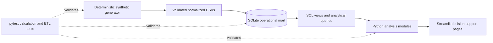

# Pharma Operations Intelligence Platform

[](https://pharma-operations-intelligence.streamlit.app/)
[](https://github.com/krati1108/Pharma-operations-intelligence-platform./actions/workflows/tests.yml)

An end-to-end pharmaceutical supply-chain analytics project that converts synthetic
operational data into validated demand forecasts, inventory policies, expiry-risk
signals, supplier scorecards, and replenishment recommendations. The implementation
combines a reproducible Python ETL pipeline, a normalized SQLite warehouse,
analytical SQL, tested business logic, and a six-page Streamlit dashboard.

## Live dashboard

Launch the hosted application: **[Pharma Operations Intelligence Platform on
Streamlit](https://pharma-operations-intelligence.streamlit.app/)**

> **Data disclaimer:** Every company, product, batch, order, quantity, price, and
> performance result in this project is fictional and generated for portfolio use.
> The fixed simulation date is **September 27, 2026**. No patient or personally
> identifiable data is present.

## Business problem

Pharmaceutical operations teams need to balance product availability, working
capital, shelf life, quality, and supplier reliability. Those decisions are difficult
when demand, batches, inventory policies, and purchase orders live in separate
systems. A planner needs to answer connected questions:

- Which SKU-location positions may stock out before the next delivery?
- How much should be reordered after accounting for lead time and safety stock?
- Which batches should be allocated first or transferred before expiry?
- Which suppliers create delivery or quality risk?
- What demand should the network expect over the next 12 weeks?
- What risks and opportunities matter at the executive level?

## Solution

The platform creates a single decision-support layer across 24 products, 11
therapeutic areas, four regional distribution centers, eight suppliers, 9,984 weekly
demand observations, 192 inventory batches, and 384 purchase orders. It provides:

- deterministic synthetic source data and validation rules;
- transactional loading into a normalized SQLite model;
- SQL views for inventory, expiry, supplier, and executive metrics;
- stockout risk, weeks of supply, safety stock, and order-up-to logic;
- batch-level FEFO (first-expire, first-out) action queues;
- supplier on-time, fill-rate, quality-acceptance, and lead-time analysis;
- a regularized seasonal-trend forecast with a 12-week holdout, seasonal-naive
  benchmark, empirical uncertainty band, and 12-week future horizon;
- automated tests for core calculations, data integrity, ETL, and database views;
- an interactive Streamlit dashboard designed for executive and planner workflows.

## Architecture



The CSV layer makes source data inspectable, SQLite provides relational constraints
and portable SQL analytics, and Python owns calculations that benefit from reuse or
modeling. The dashboard consumes those tested layers rather than reimplementing KPI
logic.

## Technology stack

- **Python 3.10+** for generation, ETL, business logic, and modeling
- **pandas / NumPy** for data preparation and analytical calculations
- **SQLite** for normalized storage, constraints, views, joins, CTEs, and windows
- **scikit-learn** for regularized seasonal-trend forecasting
- **Streamlit / Plotly** for the interactive analytics application
- **pytest** for calculation, pipeline, integrity, and SQL-view tests

## Project structure

```text
.
├── .github/
│   └── workflows/
│       └── tests.yml
├── .streamlit/
│   └── config.toml
├── dashboard/
│   └── app.py
├── data/
│   ├── raw/
│   │   ├── inventory_batches.csv
│   │   ├── products.csv
│   │   ├── purchase_orders.csv
│   │   ├── suppliers.csv
│   │   ├── warehouses.csv
│   │   └── weekly_sales.csv
│   └── README.md
├── notebooks/
│   └── README.md
├── sql/
│   ├── analytical_queries.sql
│   └── schema.sql
├── src/
│   ├── __init__.py
│   ├── config.py
│   ├── data_pipeline.py
│   ├── database.py
│   ├── demand_forecasting.py
│   ├── expiry_analysis.py
│   ├── inventory_analysis.py
│   └── supplier_analysis.py
├── tests/
│   ├── test_data_pipeline.py
│   ├── test_dashboard.py
│   ├── test_demand_forecasting.py
│   ├── test_expiry_analysis.py
│   ├── test_inventory_analysis.py
│   └── test_supplier_analysis.py
├── .gitignore
├── LICENSE
├── README.md
├── requirements-dev.txt
└── requirements.txt
```

`data/pharma_operations.db` is produced by ETL and intentionally ignored by Git.
The application automatically builds it if it does not exist.

## Setup on macOS with VS Code

1. Open the project folder in VS Code:

   ```bash
   cd "/path/to/Pharma Operations Intelligence Platform"
   code .
   ```

2. Create and activate an isolated environment from the VS Code terminal:

   ```bash
   python3 -m venv .venv
   source .venv/bin/activate
   python -m pip install --upgrade pip
   python -m pip install -r requirements.txt
   ```

3. In VS Code, run **Python: Select Interpreter** from the Command Palette and choose
   `.venv/bin/python`.

4. Build the CSV sources and SQLite database:

   ```bash
   python -m src.data_pipeline
   ```

5. Run the automated tests:

   ```bash
   python -m pytest -q
   ```

6. Launch the dashboard:

   ```bash
   python -m streamlit run dashboard/app.py
   ```

Streamlit will print a local URL, normally `http://localhost:8501`. The ETL command is
safe to rerun: it rebuilds the deterministic raw data and database from the configured
seed.

## Data and ETL design

`src/data_pipeline.py` uses a seeded NumPy generator to create operational behavior,
not independent random columns. Demand includes trend, annual seasonality, therapy-
specific winter effects, promotions, warehouse volume, and controlled service
failures. Inventory coverage cycles through risk states. Purchase-order outcomes use
supplier-specific lead-time, delivery-reliability, fill-rate, and quality profiles.

Before loading, the pipeline checks primary-key uniqueness, foreign-key membership,
date sequencing, and quantity rules. SQLite adds database-level `PRIMARY KEY`,
`FOREIGN KEY`, `UNIQUE`, and `CHECK` constraints. Loading occurs in dependency order
inside one transaction.

### Normalized database

| Table | Grain | Purpose |
|---|---|---|
| `simulation_config` | One row per generated scenario | Business date used consistently by analytical views |
| `suppliers` | One row per supplier | Contracted lead time and supplier attributes |
| `products` | One row per product | Therapy, dosage, cost, price, and primary supplier |
| `warehouses` | One row per distribution center | Location and region attributes |
| `weekly_sales` | Product × warehouse × week | Demand, fulfilled units, lost units, and revenue |
| `inventory_batches` | Batch × warehouse | On-hand units, manufacture/expiry, reorder point, safety stock |
| `purchase_orders` | One row per PO | Promised/actual dates, ordered/received/accepted units, status, cost |

`sql/schema.sql` also defines the `v_inventory_health`, `v_expiry_risk`,
`v_supplier_performance`, and `v_executive_kpis` views. The separate query library in
`sql/analytical_queries.sql` demonstrates multi-table joins, CTEs, conditional
aggregation, `CASE`, rolling averages, `LAG`, `ROW_NUMBER`, `DENSE_RANK`, and `NTILE`.

## KPI definitions

| KPI | Definition |
|---|---|
| Total Revenue | Sum of fulfilled units × product unit price across the 104-week simulation |
| Units Sold | Sum of fulfilled weekly product-location demand |
| Inventory Value | Usable, unexpired batch units × standard unit cost |
| Critical Stockout SKUs | SKU-location positions with on-hand inventory at or below safety stock |
| Weeks of Supply | On-hand units ÷ trailing 12-week average weekly demand; network KPI is demand-weighted |
| Replenishment Flag | Position where usable stock plus open-PO units is at or below the reorder point |
| Safety Stock | Buffer inventory; reusable calculator uses `z × weekly demand σ × √lead-time weeks` |
| Reorder Point | Average weekly demand × lead-time weeks + safety stock |
| Recommended Order | `max(0, demand × (lead time + 4-week review period) + safety stock − usable on hand − open PO units)` |
| Inventory Expiring in 90/180 Days | Units already expired or reaching expiry within the inclusive horizon |
| Expiry Value at Risk | Cost value of expired and horizon-expiring on-hand batches |
| Supplier On-Time Delivery | Delivered POs received on/before promise date ÷ delivered POs |
| Supplier Acceptance / Quality | Accepted units ÷ received units for delivered POs |
| Supplier Fill Rate | Received units ÷ ordered units for delivered POs |
| Forecasted Demand | Sum of point forecasts for the selected next 12 weeks |
| MAE | Mean absolute unit error on the 12-week holdout |
| MAPE | Mean absolute percentage error on nonzero holdout demand |

## Forecasting methodology

The forecasting module first aggregates demand to the chosen network, product,
warehouse, or product-warehouse level. It then:

1. orders observations at weekly grain and requires at least 64 weeks so annual
   seasonal validation is possible;
2. reserves the latest 12 observed weeks as an untouched test set;
3. creates a linear trend plus Fourier terms for annual, semiannual, and quarterly
   seasonality;
4. fits a Ridge regression on training history;
5. compares MAE and zero-safe MAPE with a 52-week seasonal-naive benchmark;
6. derives an empirical 80% uncertainty band from holdout residual quantiles;
7. refits on all 104 observed weeks and creates a nonnegative 12-week forecast.

This transparent model is appropriate for the explainable synthetic seasonal demand
in the portfolio project. Production improvements could introduce intermittent-
demand models, causal features, hierarchical reconciliation, probabilistic intervals,
and rolling-origin model selection.

## Dashboard functionality

The interface uses a high-contrast plum, burgundy, amber, and cream control-tower
design with responsive command strips, carded controls, page-specific analysis tabs,
consistent risk colors, accessible charts, and actionable error states. It detects a
missing or stale database contract automatically and provides a one-click rebuild
option without exposing raw tracebacks to business users.

- **Executive Overview:** revenue, units, inventory value, service, stockout,
  replenishment, expiry, supplier KPIs, weekly trends, warehouse exposure, and therapy
  performance.
- **Inventory Risk:** warehouse and therapy filters, coverage/value segmentation,
  stockout tiers, safety stock, reorder points, and a position-level action queue.
- **Expiry Risk:** 90/180-day exposure, shelf-life buckets, high-value batches, and
  FEFO actions for quarantine, transfer, allocation, or monitoring.
- **Supplier Performance:** on-time delivery, quantity-weighted fill and acceptance,
  composite score, performance tiers, lead time, and underlying PO evidence.
- **Demand Forecast:** interactive product and warehouse selection, holdout accuracy,
  seasonal-naive comparison, empirical uncertainty band, actual-vs-predicted
  visualization, and a 12-week forecast table.
- **Replenishment Recommendations:** recommended units and purchase value by warehouse,
  with the demand, lead-time, review-cycle, and safety-stock inputs visible.

## Simulated business insights

The following findings are calculated from the generated seed-42 scenario; they are
**simulated analytical outputs, not claims about a real company**:

- The network generated **$19.69 million** in simulated 104-week revenue and sold
  **825,046 units**.
- Usable inventory is valued at **$497,125**, with **7.16 weeks** of demand-weighted
  network coverage. The calculation excludes 2,388 expired units from available stock.
- **18 of 96** SKU-location positions are critical and **48** require net replenishment
  after accounting for 4,409 open-PO units, showing that broad network coverage can
  conceal local stockout exposure.
- **32,249 units** worth **$243,682** are already expired or expire within 180 days;
  this is exposure requiring review, not an assumed write-off.
- Average supplier on-time delivery is **89.7%**, while unit acceptance is **97.6%**.
  Pacific Therapeutics is the lowest on-time supplier in this simulation at **81.4%**.
- The network-level model forecasts **108,182 units** over the next 12 weeks. Its
  12-week holdout performance is **85.9 units MAE** and **1.0% MAPE** for aggregated
  demand, an **82.4% MAE improvement** over the seasonal-naive benchmark;
  product-location accuracy varies and is shown interactively.

## Testing and quality controls

Run the complete suite with `python -m pytest -q`. Tests cover:

- safety stock, reorder point, weeks of supply, and order recommendation math;
- risk classification and invalid-input handling;
- expiry buckets and value-at-risk horizons;
- supplier on-time, weighted fill-rate, and acceptance calculations;
- forecast shapes, nonnegative outputs, MAE/MAPE, and minimum history checks;
- forecast benchmark and uncertainty-band behavior;
- synthetic source grain and integrity;
- end-to-end ETL, configurable business date, stock/on-order reconciliation, SQLite
  integrity, row counts, and analytical views;
- headless rendering of all six Streamlit navigation paths.

Contributor-quality static checks can be run with:

```bash
python -m pip install -r requirements-dev.txt
ruff check src dashboard tests
```

The included GitHub Actions workflow rebuilds the database, runs Ruff, and executes
the complete test suite on Python 3.11 and 3.12 for every push and pull request.

## Future improvements

- Replace the empirical residual band with calibrated probabilistic forecasts and
  service-level-specific prediction intervals.
- Compare seasonal naive, exponential smoothing, gradient boosting, and intermittent-
  demand methods using rolling-origin validation.
- Optimize multi-echelon safety stock under lead-time uncertainty and target service.
- Add cold-chain temperature excursions, recalls, substitutions, and regulatory holds.
- Model in-transit inventory and net open purchase orders into projected availability.
- Introduce role-based access, scheduled orchestration, data-quality monitoring, and a
  cloud warehouse for production-scale deployment.

## License

Released under the MIT License. See [LICENSE](LICENSE). This repository was built as
an original portfolio implementation and does not include third-party source code.
